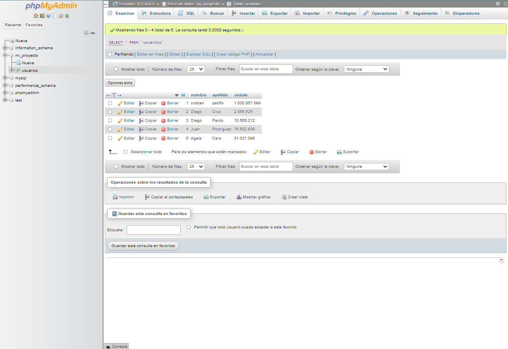
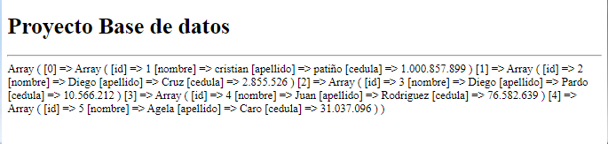

<h1>Taller Unidad 10 : David Ricaurte</h1>
<h2>Informacion</h2>

Curso: Full Stack

Profesor: Cristian Patiño

<h2>Punto 1: </h2>
<h2>Punto 2: </h2>
<h2>Punto 3: </h2>
<h2>Punto 4: </h2>
<h2>Punto 5-6-7: </h2>
<h3>Punto 5 - Base de datos</h3>

<h3>Punto 6 - Conexión</h3>
